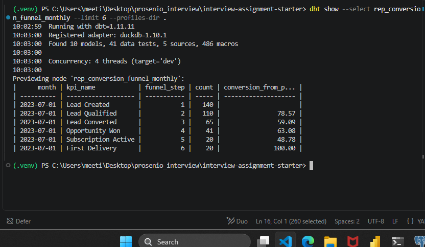
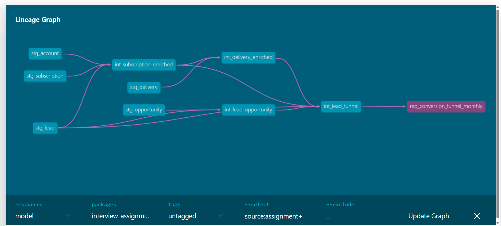

# CRM Conversion Funnel Analytics

A dbt analytics project built on DuckDB to model the customer journey from lead creation through opportunity conversion, subscription activation, and first delivery.

The project transforms raw CRM data into a cohort-based monthly conversion funnel while explicitly addressing duplicate records, inconsistent CRM values, broken entity relationships, and cross-stage funnel inconsistencies.

The final reporting model is:

`rep_conversion_funnel_monthly`

---

## Business Context

The company delivers medical products to patients through recurring subscriptions across multiple brands in Germany.

The customer journey represented in the CRM is:

```text
Lead
  ↓
Opportunity
  ↓
Subscription
  ↓
Delivery
```

The primary analytical objective is to understand how effectively leads progress through this journey and identify where conversion losses occur.

The reporting model follows each lead through the complete funnel while assigning all downstream activity to the month in which the original lead was created.

This creates a **cohort-based conversion funnel** rather than a calendar-period activity report.

---

# Architecture

The project follows a layered dbt architecture:

```text
Raw CRM Sources
      │
      ▼
   Staging
      │
      ▼
 Intermediate
      │
      ▼
    Marts
      │
      ▼
rep_conversion_funnel_monthly
```

Each layer has a distinct responsibility.

### Staging

The staging layer cleans and standardizes individual source entities while remaining close to the source system.

Responsibilities include:

- column renaming
- type standardization
- deterministic deduplication
- categorical value normalization
- preservation of relevant raw values for traceability

### Intermediate

The intermediate layer resolves relationships between CRM entities and constructs reusable business logic describing the customer journey.

It separates entity-level transformation from the final reporting logic.

### Marts

The marts layer contains the management-facing analytical model.

The final model exposes the monthly cohort conversion funnel at the required reporting grain.

---

# Project Structure

```text
.
├── ASSIGNMENT.md
├── dbt_project.yml
├── profiles.yml
├── requirements.txt
├── README.md
│
├── data/
│   └── interview_assignment.duckdb
│
├── models/
│   │
│   ├── _sources.yml
│   │
│   ├── staging/
│   │   ├── stg_lead.sql
│   │   ├── stg_account.sql
│   │   ├── stg_opportunity.sql
│   │   ├── stg_subscription.sql
│   │   ├── stg_delivery.sql
│   │   └── staging.yml
│   │
│   ├── intermediate/
│   │   ├── int_lead_opportunity.sql
│   │   ├── int_subscription_enriched.sql
│   │   ├── int_delivery_enriched.sql
│   │   └── int_lead_funnel.sql
│   │
│   └── marts/
│       └── rep_conversion_funnel_monthly.sql
│
└── tests/
    └── custom data tests
```

The DuckDB source file is intentionally excluded from Git and is not committed to the public repository.

---

# Source Data

Five CRM entities are used.

| Source | Purpose |
|---|---|
| `LEAD` | Entry point into the customer acquisition funnel |
| `OPPORTUNITY` | Represents progression of a lead into the sales process |
| `SUBSCRIPTION__C` | Represents the patient's subscription lifecycle |
| `DELIVERY__C` | Represents individual product deliveries |
| `ACCOUNT` | Represents patient/customer accounts |

The relationships between the entities were determined through schema inspection and data profiling rather than relying only on the supplied glossary.

The principal analytical journey is:

```text
LEAD
  │
  │ lead_id
  ▼
OPPORTUNITY
  │
  │ lead/account relationships
  ▼
SUBSCRIPTION
  │
  │ subscription_id
  ▼
DELIVERY
```

`ACCOUNT` provides additional patient/account context used when resolving relationships around opportunities and subscriptions.

---

# Data Exploration and Quality Findings

The source data contains several characteristics typical of operational CRM systems.

Rather than silently removing every problematic record, the project distinguishes between issues that must be corrected for reliable reporting and issues that should remain visible as source-system quality signals.

---

## Duplicate Leads

Initial profiling of the raw `LEAD` table identified:

| Metric | Count |
|---|---:|
| Source rows | 3,268 |
| Distinct Lead IDs | 3,253 |
| Duplicate Lead IDs | 15 |

The duplicated records were highly similar and differed primarily in timestamps.

Because the reporting grain requires one business Lead per `lead_id`, a deterministic deduplication rule was introduced in the staging layer.

The resulting `stg_lead` model contains:

**3,253 unique leads.**

This prevents duplicated source records from inflating funnel counts.

---

## Opportunity Stage Standardization

Profiling of `OPPORTUNITY.STAGE_NAME` revealed inconsistent formatting.

Values representing the same business stage contained differences such as:

- leading whitespace
- trailing whitespace
- repeated internal whitespace
- inconsistent formatting

The staging model therefore normalizes the values by:

1. trimming leading and trailing whitespace,
2. collapsing repeated internal whitespace,
3. normalizing case for comparison,
4. mapping the normalized values back to canonical business labels.

For example:

```text
"Closed Won "
"Closed  Won"
"closed won"
```

are interpreted as:

```text
Closed Won
```

The original value is retained as `stage_name_raw` for traceability.

This is important because cleaning should improve analytical consistency without destroying evidence of the original source-system value.

---

# Referential Integrity Findings

Relationship testing identified several records whose foreign keys do not resolve to the expected parent entity.

| Relationship | Unmatched records |
|---|---:|
| Subscription → Lead | 7 |
| Subscription → Account | 13 |
| Delivery → Subscription | 3 |

These are treated as **source-data quality issues**, not transformation failures.

The corresponding dbt relationship tests therefore use:

```yaml
severity: warn
```

rather than failing the complete pipeline.

This decision is deliberate.

Dropping the records would hide genuine CRM quality problems, while treating them as fatal errors would prevent otherwise valid analytical data from being processed.

The pipeline therefore:

- preserves the anomalous records,
- exposes the integrity violations through dbt tests,
- prevents them from silently influencing relationships that cannot be established,
- allows the overall analytical build to complete.

---

# Funnel Definition

The reporting model contains six funnel stages.

| Step | KPI | Business Definition |
|---:|---|---|
| 1 | Lead Created | Lead exists in the creation cohort |
| 2 | Lead Qualified | Lead status is `Qualified` |
| 3 | Lead Converted | `is_converted = true` |
| 4 | Opportunity Won | Associated opportunity reached `Closed Won` |
| 5 | Subscription Active | Associated subscription has status `Active` |
| 6 | First Delivery | At least one delivery exists for the associated subscription |

---

# Cohort Definition

The funnel is cohort based.

Each Lead belongs permanently to the month derived from:

```text
LEAD.CREATED_DATE
```

Downstream events do **not** determine the reporting month.

For example:

```text
Lead Created        2024-01-15
Opportunity Won     2024-01-25
Subscription Active 2024-02-02
First Delivery      2024-03-01
```

All six stages, if reached, contribute to the:

```text
2024-01-01 cohort
```

This allows the model to answer:

> Of the Leads acquired in a particular month, how many eventually progressed through each stage of the customer journey?

rather than mixing acquisition and downstream operational activity from unrelated cohorts.

---

# Funnel Semantics

## Independent vs Strict Sequential Interpretation

Data profiling revealed **cross-stage inconsistencies**.

Some Leads satisfy the condition of a later funnel stage without satisfying every preceding stage.

Two possible interpretations were therefore evaluated.

### Independent Funnel

Each stage is evaluated according to its own business condition regardless of whether previous stages were satisfied.

Across the complete dataset this produced:

| Stage | Leads |
|---|---:|
| Lead Created | 3,253 |
| Lead Qualified | 1,939 |
| Lead Converted | 996 |
| Opportunity Won | 552 |
| Subscription Active | 271 |
| First Delivery | 264 |

This interpretation preserves all observed downstream activity.

However, it does not guarantee that every later-stage population is a subset of the preceding stage.

---

## Strict Sequential Funnel

The alternative interpretation requires every Lead to satisfy the complete preceding path before entering the next stage.

The logic therefore follows:

```text
Lead Created
    │
    ▼
Lead Qualified
    │
    ▼
Lead Converted
    │
    ▼
Opportunity Won
    │
    ▼
Subscription Active
    │
    ▼
First Delivery
```

The resulting overall counts are:

| Stage | Leads |
|---|---:|
| Lead Created | 3,253 |
| Lead Qualified | 1,939 |
| Lead Converted | 996 |
| Opportunity Won | 547 |
| Subscription Active | 263 |
| First Delivery | 263 |

---

# Selected Approach: Strict Sequential Funnel

The **strict sequential interpretation** was selected for the final management reporting model.

The primary purpose of the model is to communicate conversion through a defined customer journey.

Therefore the following invariant is expected:

```text
Stage 1 >= Stage 2 >= Stage 3 >= Stage 4 >= Stage 5 >= Stage 6
```

Strict sequencing provides several advantages:

- funnel counts are monotonically non-increasing,
- conversion percentages remain between 0% and 100%,
- each stage has a clear denominator,
- each conversion rate describes progression from the immediately preceding stage,
- inconsistent CRM relationships cannot artificially increase a later funnel stage.

The trade-off is that some observed downstream activity is excluded when the upstream journey is inconsistent.

This is intentional.

Rather than forcing those records into the management funnel, the anomalies remain visible through the data-quality and relationship tests and can be investigated separately.

This separates two concerns:

**Management KPI**

```text
What proportion of Leads successfully progress through the expected customer journey?
```

from:

**Data Quality**

```text
Which CRM records violate the expected customer journey?
```

---

# Impact of the Funnel Decision

The comparison between the two interpretations demonstrates that the selected semantics have a measurable effect.

| Stage | Independent | Strict |
|---|---:|---:|
| Lead Created | 3,253 | 3,253 |
| Lead Qualified | 1,939 | 1,939 |
| Lead Converted | 996 | 996 |
| Opportunity Won | 552 | 547 |
| Subscription Active | 271 | 263 |
| First Delivery | 264 | 263 |

The difference appears primarily in the downstream stages, where CRM relationship and lifecycle inconsistencies become more relevant.

The strict funnel sacrifices a small amount of observed downstream activity in exchange for a logically consistent conversion metric.

---

# Final Reporting Model

The final reporting model is:

```text
rep_conversion_funnel_monthly
```

Its grain is:

```text
one row per (month, funnel_step)
```

The output contains:

| Column | Description |
|---|---|
| `month` | Lead creation cohort month |
| `kpi_name` | Name of the funnel stage |
| `funnel_step` | Stage number from 1–6 |
| `count` | Number of Leads from the cohort reaching the stage |
| `conversion_from_previous_pct` | Conversion from the immediately preceding stage |

The conversion calculation is:

```text
current stage count
------------------- × 100
previous stage count
```

For funnel step 1:

```text
conversion_from_previous_pct = NULL
```

because there is no preceding stage.

---
### Executed Model Output

The final model was executed directly with `dbt show`, confirming the
six-stage cohort structure and stage-to-stage conversion metrics.




For the July 2023 cohort of 140 created leads:

- 110 became Qualified,
- 65 became Converted,
- 41 reached a Won Opportunity,
- 20 reached an Active Subscription,
- all 20 of those Leads had at least one Delivery under the selected strict funnel semantics.

---

# Testing Strategy

Testing is applied at multiple levels of the transformation pipeline.

## Primary Key Integrity

Core entity identifiers are tested for:

```text
unique
not_null
```

including:

- `lead_id`
- `account_id`
- `opportunity_id`
- `subscription_id`
- `delivery_id`

---

## Domain Validation

Important categorical fields are validated with `accepted_values`.

Examples include:

- Lead status
- Opportunity stage
- Subscription status
- Delivery status
- Brand
- Delivery cycle

This prevents unexpected categorical values from silently entering business logic.

---

## Relationship Testing

Relationships between the CRM entities are validated using dbt `relationships` tests.

Known source-system violations are configured as warnings so that they remain observable without blocking the analytical pipeline.

Current findings:

```text
Subscription → Lead          7 warnings
Subscription → Account      13 warnings
Delivery → Subscription      3 warnings
```

These counts refer to violating source records; dbt reports each relationship rule as one warning-producing test.

---

## Final Model Testing

The final reporting model includes tests for:

- required fields,
- reporting grain,
- funnel semantics.

The combination:

```text
(month, funnel_step)
```

must be unique.

The strict funnel must additionally satisfy:

```text
count(step N) <= count(step N - 1)
```

for every cohort month.

This test directly validates the most important modelling decision made in the assignment.

---

# Build Result

The complete project can be validated using:

```bash
dbt build --profiles-dir .
```

Current build result:

```text
PASS  = 48
WARN  = 3
ERROR = 0
```

The three warnings correspond to the intentionally non-blocking referential-integrity tests:

1. Subscription → Lead
2. Subscription → Account
3. Delivery → Subscription

No transformation or blocking data-quality test fails.

---

# Production Considerations

The supplied dataset is local and relatively small.

For this assignment, correctness, transparency and reproducibility were prioritized over premature optimization.

A production implementation operating against a continuously changing CRM system would require additional considerations.

---

## Incremental Processing

Staging and intermediate models could be processed incrementally using source modification timestamps such as:

```text
LAST_MODIFIED_DATE
```

However, the final cohort model should not simply process the newest Lead month.

Historical cohorts remain mutable.

For example, a Lead created three months ago could receive its first Delivery today.

The production process must therefore identify changes in downstream entities and determine which original Lead cohorts are affected.

Two practical strategies are possible:

1. recompute a rolling historical window, or
2. identify affected Lead IDs from changed upstream records and selectively rebuild their corresponding cohort months.

For larger production datasets, the second approach would reduce unnecessary processing.

---

# Late-Arriving Data

Late-arriving Opportunities, Subscriptions or Deliveries must update the cohort of the **original Lead**.

For example:

```text
Lead Created        January
Opportunity Won     January
Subscription Active February
First Delivery      March
```

The resulting First Delivery still contributes to the:

```text
January cohort
```

not March.

This is necessary to preserve the cohort definition.

A daily production process must therefore be capable of updating historical cohort results when downstream events arrive late.

---

# Subscription Reactivation

Subscription status may change over time.

A cancelled or inactive subscription could later become active again.

This introduces an important distinction between:

```text
Current state
```

and:

```text
Ever reached stage
```

The supplied dataset does not provide a complete event history for every lifecycle transition.

For this assignment, the funnel follows the supplied source-state fields and the explicitly defined business conditions.

In a production environment, I would clarify with business stakeholders whether:

```text
Subscription Active
```

means:

- currently active, or
- has ever reached active status.

If historical funnel achievement is required, subscription status history or event-level data should be retained rather than relying only on the latest CRM state.

---

# Idempotency

The transformation logic is deterministic.

Given an unchanged source snapshot:

```bash
dbt build --profiles-dir .
```

produces the same analytical result on repeated executions.

The reporting model therefore supports idempotent daily recomputation.

This is particularly useful for the current dataset size because full recomputation provides a simple and reliable baseline without introducing unnecessary incremental-state complexity.

---

# Assumptions and Trade-offs

Several decisions were made explicitly under uncertainty.

### Duplicate Leads

Duplicate Lead IDs are interpreted as duplicate source records rather than separate business entities.

A deterministic rule establishes one Lead record per `lead_id`.

### Opportunity Stage Cleaning

Opportunity stage formatting is standardized for analytical consistency.

The original value is retained for traceability.

### Referential Integrity

Broken relationships are surfaced rather than silently removed.

Known violations generate dbt warnings instead of blocking the complete pipeline.

### Funnel Semantics

Strict sequential semantics are used for management reporting.

Later-stage activity that does not satisfy the complete upstream journey is excluded from the funnel but remains available for data-quality investigation.

### Cohort Attribution

All funnel stages are attributed to the month in which the original Lead was created.

### Lifecycle History

Current source-state fields are used where complete historical state-transition data is unavailable.

### Performance

For the supplied dataset, correctness and explainability are prioritized over incremental optimization.

---

# Running the Project

## 1. Create a Virtual Environment

```bash
python -m venv .venv
```

Activate it.

### Windows

```bash
.venv\Scripts\activate
```

### macOS / Linux

```bash
source .venv/bin/activate
```

---

## 2. Install Dependencies

```bash
pip install -r requirements.txt
```

---

## 3. Add the DuckDB File

Place:

```text
interview_assignment.duckdb
```

inside:

```text
data/
```

The expected path is:

```text
data/interview_assignment.duckdb
```

The database file is excluded through `.gitignore` and must not be committed to the public repository.

---

## 4. Validate the Connection

```bash
dbt debug --profiles-dir .
```

---

## 5. Build the Project

```bash
dbt build --profiles-dir .
```

This executes the models and associated tests.

The expected result is a successful build with the documented relationship warnings.

---

## 6. Inspect the Final Model

The final reporting model can be inspected with:

```bash
dbt show --select rep_conversion_funnel_monthly --profiles-dir .
```

---

## dbt Lineage

The project follows a layered dbt architecture separating source cleaning,
entity enrichment, funnel construction, and reporting logic.

The staging layer standardizes and validates the CRM source entities.
Intermediate models resolve the relationships between leads, opportunities,
subscriptions, accounts, and deliveries. `int_lead_funnel` consolidates these
relationships at lead grain and applies the funnel-stage indicators.

The final `rep_conversion_funnel_monthly` model aggregates the lead-level
funnel into monthly lead cohorts and calculates conversion between consecutive
funnel stages.



---

# Technology Stack

| Technology | Purpose |
|---|---|
| SQL | Transformation and business logic |
| dbt Core | Transformation framework, testing and lineage |
| dbt-duckdb | dbt adapter |
| DuckDB | Local analytical database |
| Git | Version control |
| GitHub | Public project repository |

---

# Management Report

A separate management-facing report accompanies this project.

The report intentionally separates business communication from technical implementation.

While this README explains:

- data modelling,
- data quality,
- funnel semantics,
- testing,
- operational considerations,

the management report focuses on:

- conversion performance,
- funnel drop-off,
- cohort development,
- relevant business differences,
- actionable recommendations.

The objective is to translate the analytical model into decisions rather than expose implementation details to a non-technical audience.

---

# Summary

This project builds a reproducible cohort-based conversion funnel from operational CRM data containing duplicates, inconsistent categorical values and broken entity relationships.

The final solution deliberately separates:

```text
Source-system reality
        ↓
Data-quality handling
        ↓
Business modelling
        ↓
Management KPI
```

The most important modelling decision is the use of a **strict sequential funnel**.

This ensures that management conversion metrics describe progression through a logically consistent customer journey while source-system anomalies remain separately visible and testable.

The resulting dbt project completes successfully with:

```text
48 PASS
3 WARN
0 ERROR
```

and produces the required:

```text
rep_conversion_funnel_monthly
```

reporting model.